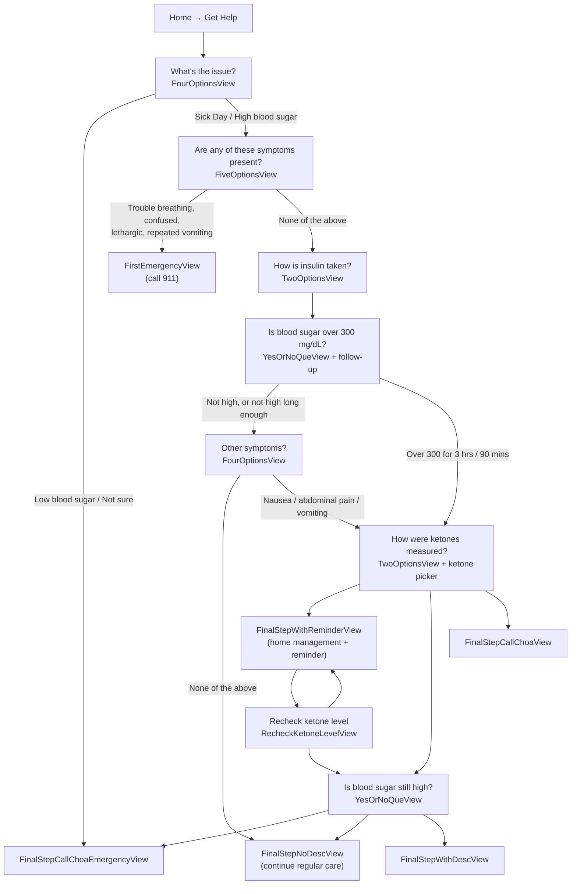

# CHOA Diabetes Education Mobile App

## Table of Contents

- [Overview](#overview)
- [Purpose](#purpose)
- [Current Status](#current-status)
- [Features](#features)
- [Project Structure](#project-structure)
  - [Directory Layout](#directory-layout)
  - [Relevant Files](#relevant-files)
- [Sick Day / Get Help Flow](#sick-day--get-help-flow)
  - [How the Flow Is Built](#how-the-flow-is-built)
  - [State and Persistence](#state-and-persistence)
  - [Step-by-Step Walkthrough](#step-by-step-walkthrough)
  - [Supporting Subviews](#supporting-subviews)
  - [Reminders and Notifications](#reminders-and-notifications)
  - [Back Navigation, Counters, and Resets](#back-navigation-counters-and-resets)
  - [Screen Theming](#screen-theming)
- [How To: Extend the Questionnaire](#how-to-extend-the-questionnaire)
  - [Add a New Question (Existing Type)](#add-a-new-question-existing-type)
  - [Add a New Question Type](#add-a-new-question-type)
  - [Show a Screen](#show-a-screen)
- [Calculator Flows](#calculator-flows)
  - [Know Your Carbs](#know-your-carbs)
  - [Meal and High-Blood-Sugar Calculators](#meal-and-high-blood-sugar-calculators)
- [Acknowledgements](#acknowledgements)
- [License](#license)
- [Contact](#contact)

## Overview
This mobile application is designed to support families with children newly diagnosed with Type 1 Diabetes at Children's Healthcare of Atlanta (CHOA). The app serves as a crucial educational and support tool, currently being utilized in an observational study to assess its effectiveness in helping families navigate the challenges of Type 1 Diabetes management.

## Purpose
The primary goal of this application is to provide:
- Educational resources for families new to Type 1 Diabetes management
- Support tools for daily diabetes care
- Information and guidance during the critical initial period after diagnosis
- A platform for collecting observational study data to improve diabetes care

## Current Status
The application is actively being used in an observational study at Children's Healthcare of Atlanta, helping to gather valuable data on how families adapt to and manage Type 1 Diabetes diagnoses.

## Features
- Medically verified educational content by the CHOA diabetes Team
- Resources for new onset patients
- Calculator guidance for insulin for food, high blood sugar, or both
- A **Know Your Carbs** food catalogue and carb-counting flow
- A guided **Sick Day / Get Help** triage questionnaire with ketone tracking and recheck reminders

## Project Structure

The app is a UIKit project (no SwiftUI app lifecycle). Screens are built from storyboards and XIBs; there is no dependency-injection container — shared state lives in a handful of singletons. Third-party packages are resolved through SwiftPM: **Lottie**, **Firebase (Crashlytics)**, and **Pendo** (analytics).

### Directory Layout

```
choa-diabetes-education/                     # repo root
├── choa-diabetes-education.xcodeproj
├── README.md
└── choa-diabetes-education/                 # app target
    ├── Delegates/                           # AppDelegate, SceneDelegate
    ├── Models/                              # Questionnaire graph, question/answer enums, carb + content models
    ├── Managers/                            # Singletons: reminders, carb totals, custom foods, calculator constants
    ├── Helpers/                             # Reminder persistence + notification-tap routing
    ├── ViewControllers/                     # One class per screen
    ├── Views/
    │   ├── QuestionnaireViews/              # Every Sick Day / Get Help screen body (XIB-backed UIViews)
    │   └── PopUps/                          # InfoPopUpViewController
    ├── CustomComponents/                    # PrimaryButton, RoundedButton, RoundedButtonWithImage
    ├── Extensions/                          # UIColor/UIFont/UILabel/UIView helpers, external URLs
    ├── Base.lproj/                          # Main.storyboard, LaunchScreen, Orientation~
    ├── choa-diabetes-education/Base.lproj/  # Calculator.storyboard, Orientation.storyboard
    ├── GetHelp.storyboard                   # The Sick Day / Get Help scene
    ├── Assets/                              # Asset catalogue, fonts, Lottie animations, 32 HTML chapter pages + css/js
    ├── Localizable.strings                  # All user-facing copy
    ├── plists/GoogleService-Info.plist
    └── Info.plist
```

### Relevant Files

| Area | File | Role |
| --- | --- | --- |
| Entry | `ViewControllers/HomeViewController.swift` | Home screen; launches Get Help, the calculators, Know Your Carbs, and the education sections. Also restores an in-progress reminder on launch. |
| Sick Day | `ViewControllers/GetHelpViewController.swift` | The single view controller used for **every** step of the Sick Day flow. |
| Sick Day | `GetHelp.storyboard` | Scene holding all step views plus the ketone-measurement info sheet. |
| Sick Day | `Models/QuestionnaireManager.swift` | Singleton that owns the answers, the routing rules, and the ketone/visit persistence. |
| Sick Day | `Models/Questionnaire.swift`, `Models/QuestionType.swift` | The question object passed between screens and the enums for every question id / answer. |
| Sick Day | `Views/QuestionnaireViews/*` | The step bodies (see [Supporting Subviews](#supporting-subviews)). |
| Reminders | `Managers/ReminderManager.swift` | Schedules local notifications and drives countdowns. |
| Reminders | `Helpers/ReminderPersistence.swift` | Encodes the reminder + questionnaire state to `UserDefaults` so it survives app restarts. |
| Reminders | `Helpers/NotificationHandler.swift` | Routes a notification tap back into the ketone recheck screen. |
| Carbs | `ViewControllers/KnowYourCarbsViewController.swift`, `KnowYourCarbsResultViewController.swift`, `AddFoodItemViewController.swift` | The carb catalogue, its results screen, and custom-food entry. |
| Carbs | `Managers/CarbsCalculatorManager.swift`, `Managers/CustomFoodsManager.swift`, `Models/CarbFood.swift` | Selected servings/total, user-added foods, and the food model. |
| Calculators | `ViewControllers/Calculator*ViewController.swift`, `Managers/CalculatorConstantsManager.swift` | Insulin calculators and the stored clinician constants. |
| Education | `ViewControllers/ChapterViewController.swift`, `Models/Content.swift`, `Assets/pages/*.html` | Handbook chapters rendered in `WKWebView`, plus the quizzes. |

## Sick Day / Get Help Flow

The Sick Day flow is the **Get Help** questionnaire on the Home screen. It triages a sick child through symptoms, insulin-delivery method, blood sugar, and ketone levels, and ends on one of five outcome screens — from "continue regular care" to "call 911".

Everything below is driven by `GetHelpViewController.swift` and `QuestionnaireManager.swift`.

### How the Flow Is Built

- **One view controller, many screens.** `GetHelpViewController` is instantiated from `GetHelp.storyboard` with `init(navVC:currentQuestion:coder:)`. Its scene contains *every* step view as an outlet stacked in the same scene. `viewDidLoad()` calls `hideAllViews()` and then `setupViews()`, which unhides exactly one view based on `questionObj.questionType` and wires itself as that view's delegate.
- **Each answer pushes a new instance.** Step views report answers to the controller via their `…ViewProtocol` delegates. The controller forwards to `QuestionnaireManager`, which builds the next `Questionnaire` object and calls back through `QuestionnaireActionsProtocol.showNextQuestion(_:)`. That method instantiates another `GetHelpViewController` and pushes it, so each answered question becomes a navigation-stack entry and the system Back button walks the history.
- **`Questionnaire` is the payload.** It carries `questionId`, `questionType`, `question`, `answerOptions`, and — for outcome screens — a `FinalStep` (title, description, image name). `QuestionType` decides which view is shown; `questionId` decides the copy and the branch logic inside that view.
- **Copy lives in `Localizable.strings`.** Question titles and option labels are localized keys (`GetHelp.Que.*`, `Calculator.Que.*`, `Calculator.Final.*`, `Final.*`).



### State and Persistence

`QuestionnaireManager.instance` is the single source of truth for the run. `HomeViewController` calls `QuestionnaireManager.resetInstance()` before starting a new flow, and the X button in the nav bar resets it again on exit.

In memory:

| Property | Meaning |
| --- | --- |
| `currentTestType` | `.insulinShots` or `.pump` |
| `iLetPump` | Whether the pump is an iLet (changes every timing threshold and much of the routing) |
| `currentMeasuringMethod` | `.urineKetone` or `.bloodKetone`; switching methods clears the other method's stored value |
| `bloodSugarOver300` / `bloodSugarOver300For3Hours` | Answers to the blood-sugar question and its follow-up |
| `yesOver2hours` | The wait period has elapsed (2 hrs, or 90 mins on iLet) |
| `skipFirstReminder` | The first reminder was skipped, or was never offered because ketones were already elevated |

Persisted in `UserDefaults` (so a backgrounded or relaunched app can resume mid-flow):

- `persistedUrineKetoneLevel` / `persistedBloodKetoneLevel` — the current reading, reloaded by `loadPersistedKetoneState()` in `viewWillAppear`.
- `firstUrineKetoneValue` / `firstBloodKetoneValue` and `secondUrineKetoneValue` / `secondBloodKetoneValue` — the first and second readings, compared against each other in the iLet branches.
- `reminderPageVisitCount` and `ketoneVisitCount` — how many times the reminder page and the ketone-check pages have been reached. These two counters, together with `skipFirstReminder`, decide nearly every iLet branch.
- `activeReminderState` — the encoded `ReminderPersistence.ReminderState`.

`printCurrentKetoneState()` dumps all of this to the console; the flow is instrumented with emoji-prefixed logs throughout (`📊` counters, `🧪` ketones, `🔔` notifications).

### Step-by-Step Walkthrough

**1. Entry — "What's the issue?"** (`FourOptionsView`, `questionId: childIssue`)

`HomeViewController.tappedGetHelpButton` resets the manager and builds the first question. Options:

- **Sick Day** or **High Blood Sugar** → `triggerDKAWorkFlow` → symptom check.
- **Low Blood Sugar** or **Not Sure What's Wrong** → `triggerCallChoaEmergencyActionFlow` → `FinalStepCallChoaEmergencyView`.

**2. Red-flag symptoms — "Are any of these symptoms present?"** (`FiveOptionsView`, `questionId: childHasAnySymptoms`)

Trouble breathing, confused, lethargic, or repeated vomiting → `triggerFirstEmergencyActionFlow` → `FirstEmergencyView`. **None of the above** → `triggerNoSymptomsActionFlow` → insulin-method question.

**3. "How is insulin taken?"** (`TwoOptionsView`, `questionId: testType`)

- **Injection / Insulin Pen** enables Next immediately.
- **Insulin Pump** embeds a `YesOrNoFollowUpView` asking *"Is insulin delivered using iLet Pump?"*; Next stays dimmed until it is answered, and the answer sets `iLetPump`.

Next saves the test type and calls `triggerTestActionFlow`, which goes to the blood-sugar question for both methods.

**4. "Is blood sugar over 300 mg/dL?"** (`YesOrNoQueView`, `questionId: bloodSugarCheck`)

- **Yes** sets `bloodSugarOver300` and embeds a `YesOrNoFollowUpView`: *"Has the blood sugar been over 300 mg/dL for 3hrs or more?"* — or *"…for 90 mins or more?"* when `iLetPump` is set.
- Yes + follow-up **Yes** → `triggerKetoneMeasuringTypeActionFlow` (straight to ketones).
- Yes + follow-up **No**, or **No** → `triggerOtherSymptomsActionFlow`.

**5. "Are any of these symptoms present?" (second list)** (`FourOptionsView`, `questionId: otherSymptom`)

Nausea, abdominal pain, or vomiting → ketone measurement. **None of the above** → `triggerContinueActionFlow` → `FinalStepNoDescView`.

**6. "How were ketones measured?"** (`TwoOptionsView`, `questionId: measuringType`)

Selecting **Urine Ketone Level** or **Blood Ketone Level** embeds the matching picker (`UrineKetoneLevelView` with six levels, `BloodKetoneLevelView` with three) *inside* this screen; the reading and the Next button are part of the same step. A *"Learn how to measure ketones"* link opens `AboutKetoneMeasurementsViewController` as a sheet. Next increments `ketoneVisitCount`, saves the level, and routes:

- **iLet** → `triggerUrineKetoneForILetActionFlow` / `triggerBloodKetoneForILetActionFlow`. These also store the reading as the *first* ketone value and set `skipFirstReminder` — `false` for negative/low readings (the reminder page is shown), `true` for moderate and high readings.
- **Everything else** → `triggerUrineKetoneLevelActionFlow` / `triggerBloodKetoneLevelActionFlow`:
  - Urine negative or 0.5 → reminder page. Blood low → continue regular care if the wait already elapsed, otherwise the reminder page.
  - Moderate or high (urine 1.5/4/8/16, blood moderate/large) → `FinalStepCallChoaView` when blood sugar is over 300, otherwise the blood-sugar recheck question.

**7. Home management + reminder** (`FinalStepWithReminderView`, `questionType: .reminder`)

The steps shown depend on the delivery method (see the subview table). Three ways forward:

- **Remind Me** schedules a 2-hour local notification (90 minutes on iLet), starts an on-screen countdown, and persists the state. During the countdown the button becomes **Skip This Reminder**; skipping sets `skipFirstReminder`, cancels the notification, and advances the flow.
- When the countdown reaches zero the card reads *"Time to check"* and the button becomes **Start Test**.
- **Yes, Over 2hrs** / **Yes, Over 90 mins** advances immediately.

All three advance through `didSelectYesOverAction(_:)` on the controller with `yesOver2hours` set. For non-iLet users that always means `triggerRecheckKetonesActionFlow`. For iLet users the controller evaluates an ordered set of conditions over `skipFirstReminder`, `reminderPageVisitCount`, and `ketoneVisitCount`:

| # | Condition | Next screen |
| --- | --- | --- |
| 1 | skipped first, reminder visits ≥ 2, high ketones | Blood-sugar recheck |
| 2 | skipped first, reminder visits = 1, high ketones | Recheck ketones |
| 3 | skipped first, reminder visits ≥ 2, moderate ketones | Blood-sugar recheck |
| 4 | skipped first, reminder visits = 1, moderate ketones | Recheck ketones |
| 5 | did not skip, reminder visits > 2, any elevated ketones | Blood-sugar recheck |
| 6 | did not skip, reminder visits 1–2, ketone checks 1–2 | Recheck ketones |
| — | no match (logged as a warning) | Recheck ketones (fallback) |

**8. "Check ketone level" recheck** (`RecheckKetoneLevelView`, `questionType: .recheckKetoneLevel`)

Entering this screen sets `yesOver2hours` and increments `ketoneVisitCount`. It pre-selects whichever measurement method was used before, embeds that picker, and offers a *"Switch to Blood/Urine Ketone"* toggle that swaps the picker and clears the pending selection. Next routes to `triggerRecheckUrineKetoneActionFlow` / `triggerRecheckBloodKetoneActionFlow`, or their `…ForILet…` variants, which compare the new reading against the first one and the visit counters to choose between continuing care, another reminder, a blood-sugar recheck, and calling CHOA.

**9. Blood-sugar recheck** (`YesOrNoQueView`, `questionId: bloodSugarRecheck`)

The threshold in the question depends on the setup: *higher than 180 mg/dL* for iLet, *300 mg/dL or higher* for a pump after a low reading, otherwise *higher than 150 mg/dL*. For non-iLet users **Yes** → `FinalStepCallChoaView`, and **No** → continue regular care when a pump user has waited out the interval with low ketones, otherwise `FinalStepCallChoaEmergencyView`. For iLet users both answers run the visit-count table in `triggerYesActionFlow` / `triggerNoActionFlow`.

**10. Outcome screens**

`FirstEmergencyView` (911), `FinalStepCallChoaEmergencyView` (call the care team), `FinalStepCallChoaView` (managed at home with call instructions), `FinalStepNoDescView` (continue regular care), and `FinalStepWithDescView` (continue regular care with extra hydration / iLet guidance). The nav bar's close button is removed on all of them; Exit or Done returns to Home.

### Supporting Subviews

All of these live in `Views/QuestionnaireViews/` and are XIB-backed `UIView`s loaded in `nibSetup()`/`loadFromNib()`. The first group are top-level step views owned by `GetHelpViewController`; the second group are embedded inside other steps.

**Step views**

| View | Question type | What it does |
| --- | --- | --- |
| `FourOptionsView` | `.fourOptions` | Four image + label option cards with a dimmed Next until one is picked. Serves both *"What's the issue?"* and the second symptom list; the `questionId` chooses the artwork and which `FourOptionsAnswer` is emitted. |
| `FiveOptionsView` | `.fiveOptions` | Same card pattern with five options, for the red-flag symptom check. |
| `TwoOptionsView` | `.twoOptions` | Two option cards plus a `followUpQuestionStackView` that hosts a follow-up view. For `testType` the follow-up is the iLet yes/no; for `measuringType` it is the urine or blood ketone picker (with the ketone artwork and the *"Learn how to measure ketones"* link). Next stays at 30% opacity until the follow-up is answered, and for `measuringType` it also increments `ketoneVisitCount`. |
| `YesOrNoQueView` | `.yesOrNo` | Yes/No pair with an optional embedded `YesOrNoFollowUpView`. Used for the blood-sugar question (where Yes reveals the duration follow-up) and the blood-sugar recheck (where either answer enables Next immediately). |
| `RecheckKetoneLevelView` | `.recheckKetoneLevel` | The second ketone reading. Hosts the urine or blood picker in `ketoneMeasuringTypeStackView`, pre-selected from `currentMeasuringMethod`, with a *"Switch to…"* toggle and the *"Learn how…"* link. Next only fires while `yesOver2hours` is true. |
| `FinalStepWithReminderView` | `.reminder` | The home-management screen and the reminder engine. `setupCommonUI` then one of `setupForInsulinShots` / `setupForPump` / `setupForPumpWithIlet` builds the step list. The iLet variant runs a six-path decision tree over ketone level, `skipFirstReminder`, and `reminderPageVisitCount` to decide whether to tell the family to **confirm** the pump site, **change** it, or **disconnect** the pump and dose with a pen. Owns the countdown timer, the Remind Me / Skip / Start Test button states, and the `ReminderManagerDelegate` callbacks. |
| `FirstEmergencyView` | `.firstEmergency` | Red outcome screen. *"Seek Immediate Medical Attention"*, a rounded call-instructions card, a **Call 911** button (`tel://911`), and Exit. |
| `FinalStepCallChoaView` | `.callChoa` | Home-management outcome with numbered steps. Shows `injectionStackView` for pen users and `insulinPumpStackView` for pump users; `setupPumpRecheck()` collapses the later steps and rewrites the first two to *"Change pump site"* / *"Recheck blood sugar"* when the family has already waited out the interval with low ketones. Body copy is built with `setText(_:boldPhrases:)`. |
| `FinalStepCallChoaEmergencyView` | `.callChoaEmergency` | Orange outcome screen with a **Call CHOA** button (`tel://+404-785-5437`) and Exit. |
| `FinalStepNoDescView` | `.finalStepNoDesc` | Green *"Continue regular diabetes care"* screen: title, illustration, Exit. |
| `FinalStepWithDescView` | `.finalStepWithDesc` | *"Continue regular diabetes care"* with detail. Shows `iLetPumpInfoStackView` (and hides the hydration block) for iLet users, otherwise the hydration guidance. |

**Embedded views**

| View | Embedded in | What it does |
| --- | --- | --- |
| `YesOrNoFollowUpView` | `TwoOptionsView`, `YesOrNoQueView` | A second Yes/No question added to the host's follow-up stack. Its label switches on `questionId`: the iLet question after *Insulin Pump*, or the 3-hour / 90-minute duration question after *blood sugar over 300*. Reports the selection back through `YesOrNoFollowUpViewDelegate`, which enables the host's Next button. |
| `UrineKetoneLevelView` | `TwoOptionsView`, `RecheckKetoneLevelView` | Six tappable level buttons (negative, 0.5, 1.5, 4.0, 8.0, 16.0) in a bordered stack; the chosen button stays at full opacity and the rest dim. Emits the 1-based index through `UrineKetoneLevelDelegate`. |
| `BloodKetoneLevelView` | `TwoOptionsView`, `RecheckKetoneLevelView` | The same pattern with three levels — low (<0.6), moderate (0.6–1.5), large (>1.5) — reported through `BloodKetoneLevelDelegate`. |
| `AboutKetoneMeasurementsViewController` | Presented as a sheet | Explains urine vs. blood ketone measurement. Opened by `didSelectLearnHowAction()` from `TwoOptionsView` or `RecheckKetoneLevelView`, presented at an 85% custom detent. |

> `FinalStepView`, `OpenEndedQueView`, and `MultipleOptionsView` are still wired into `GetHelp.storyboard` and `GetHelpViewController`, but no branch reaches them from the current entry point — they belong to the older blood-sugar-entry calculator path, whose first question is commented out in `HomeViewController`.

### Reminders and Notifications

`ReminderManager.shared` wraps `UNUserNotificationCenter`. It requests permission when a reminder view is created, schedules one-shot `UNTimeIntervalNotificationTrigger` notifications (`scheduleTwoHourReminder()` = 7200s, `schedule90MinuteReminder()` = 5400s; `scheduleTestReminder()` = 30s exists for testing), and runs a per-identifier `Timer` that drives `countdownUpdate` / `countdownFinished` delegate callbacks. It also serves as the `UNUserNotificationCenterDelegate`, so notifications appear in the foreground.

`ReminderPersistence` saves the reminder id, scheduled time, and a snapshot of the questionnaire (test type, measuring method, ketone levels, blood-sugar flags, iLet, `yesOver2hours`, reminder visit count) as JSON in `UserDefaults`, and expires itself once the scheduled time passes. Two entry points read it back:

- `HomeViewController.checkAndRestoreActiveReminder()` runs once per launch and, if a reminder is still pending, restores the manager state and pushes straight back to the reminder page.
- `NotificationHandler.shared.handleNotificationTap(identifier:)` pops to root and pushes the **ketone recheck** screen. It is called from `ReminderManager`'s notification-response handler, which also posts a `ReminderNotificationTapped` `NotificationCenter` message so a reminder view that is already on screen can flip itself to the "Time to check" state instead of duplicating navigation.

`FinalStepWithReminderView` reconciles all three sources on appearance: persisted state first, then an in-memory `ReminderManager` countdown (the case where the user simply navigated back), then the default "Remind Me" state. Leaving the screen invalidates the countdown timer via `cleanup()`.

### Back Navigation, Counters, and Resets

Because every step is a stack entry, going back has to undo the counters that drove the routing. `GetHelpViewController.viewWillDisappear` inspects the screen being popped *and* the screen underneath it:

- Popping the reminder page back to the blood-sugar recheck or the ketone recheck decrements `reminderPageVisitCount`.
- Popping the ketone recheck back to the reminder page or the blood-sugar recheck decrements `ketoneVisitCount` but deliberately preserves the ketone readings.
- Popping back to the insulin-method question (`.twoOptions(.testType)`) or the measurement-type question from anywhere performs a full reset: `yesOver2hours` cleared, both counters zeroed, and all ketone values cleared.
- Popping out of the flow to `HomeViewController` clears everything.

Visit counts are incremented in `viewDidAppear`, and only for pushes (`hasAppearedFromPush`), so returning to a screen with Back does not double-count. The nav bar's X button (`didSelectExitAction`) clears the ketone data, resets both counters, calls `QuestionnaireManager.resetInstance()`, and pops to root; the Done button on the call-CHOA screen (`didSelectGotItAction`) clears the persisted reminder state and pops back to Home.

### Screen Theming

`updateBackgroundColorForFinalStep(questionId:)` sets both the view background and a matching `UINavigationBarAppearance` (including back-button tint) for outcome screens: red for the emergency screen, orange for call-CHOA-emergency, green for continue-regular-care, white elsewhere. `resetBackgroundColor()` restores the white/black default when the screen is popped, and the close button is removed from the nav bar on every outcome screen.

## How To: Extend the Questionnaire

Three recipes, each with one worked example. The first adds a screen using machinery that already exists; the second adds new machinery; the third covers every way a screen gets pushed on screen.

Recall the four moving parts, because each recipe touches the same ones:

1. **`Models/QuestionType.swift`** — the enums: which question types exist, which question ids exist inside each type, and which answers each type can produce.
2. **`Models/QuestionnaireManager.swift`** — factories (`create…Question`) that build a `Questionnaire`, and triggers (`trigger…ActionFlow`) that decide what comes next and hand it to `actionsDelegate?.showNextQuestion(_:)`.
3. **`Views/QuestionnaireViews/…`** — the screen body and its delegate protocol.
4. **`ViewControllers/GetHelpViewController.swift`** + **`GetHelp.storyboard`** — the outlet, the `hideAllViews()`/`setupViews()` pair, and the delegate implementation that forwards answers back to the manager.

### Add a New Question (Existing Type)

**Scenario:** after the second symptom list, when the family reports nausea, abdominal pain, or vomiting, ask *"Is your child able to keep fluids down?"* before sending them to the ketone measurement. **No** should go straight to the call-CHOA-emergency screen. This is a plain yes/no question, so `YesOrNoQueView` already does everything the screen needs.

**Step 1 — Add the question id.** In `QuestionType.swift`, extend `YesOrNoQuestionId` with a case and give it an unused number in *that* enum (ids are only unique within their own enum — `shotTwentyFourHours` is `6`, so `7` is free). Keep `id` and `init(id:)` in sync; they are separate switches and drift between them is a real source of bugs in this file.

```swift
enum YesOrNoQuestionId {
    case severeDistress
    // …
    case shotTwentyFourHours
    case fluidsCheck            // new

    var id: Int {
        switch self {
        // …
        case .shotTwentyFourHours:
            return 6
        case .fluidsCheck:
            return 7
        }
    }

    init(id: Int) {
        switch id {
        // …
        case 6:
            self = .shotTwentyFourHours
        case 7:
            self = .fluidsCheck
        default:
            self = .severeDistress
        }
    }
}
```

**Step 2 — Add the copy.** In `Localizable.strings`, next to the other `Calculator.Que.*` / `GetHelp.Que.*` keys:

```
"GetHelp.Que.FluidsCheck.title" = "Is your child able to keep fluids down?";
```

**Step 3 — Add a trigger that builds and pushes the question.** In `QuestionnaireManager.swift`, use the existing `createYesOrNoQuestion` factory. Declare the method on `QuestionnaireManagerProvider` as well, so it stays part of the protocol surface the rest of the flow is written against.

```swift
func triggerFluidsCheckActionFlow(_ currentQuestion: Questionnaire) {
    let createQue = createYesOrNoQuestion(
        questionId: .fluidsCheck,
        question: "GetHelp.Que.FluidsCheck.title".localized(),
        description: nil,
        showDescriptionAtBottom: false
    )
    actionsDelegate?.showNextQuestion(createQue)
}
```

**Step 4 — Point an existing branch at it.** The symptom list reports through `didSelectNextAction(currentQuestion:selectedAnswer: FourOptionsAnswer)` in `GetHelpViewController`. Swap the three symptom cases from the ketone trigger to the new one:

```swift
case .Nausea(_), .AbdominalPain(_), .RepeatedVomiting(_):
    self.questionnaireManager.triggerFluidsCheckActionFlow(currentQuestion)
```

**Step 5 — Handle the answer.** A yes/no screen with no follow-up reports through `didSelectNextAction(currentQuestion:userSelectedType:)`, which the controller already forwards to `triggerYesActionFlow` / `triggerNoActionFlow`. So the routing is written in the manager, not the controller — add a case to each switch:

```swift
// triggerYesActionFlow
case YesOrNoQuestionId.fluidsCheck.id:
    triggerKetoneMeasuringTypeActionFlow(currentQuestion)

// triggerNoActionFlow
case YesOrNoQuestionId.fluidsCheck.id:
    triggerCallChoaEmergencyActionFlow(currentQuestion)
```

**Step 6 — Teach the view about the new id where it branches on it.** `YesOrNoQueView` only un-dims its Next button for the question ids it knows; anything else leaves the button at 30% opacity. Add the id to both tap handlers:

```swift
// didYesButtonTap(_:)
case YesOrNoQuestionId.fluidsCheck.id:
    nextButton.alpha = 1

// didNoButtonTap(_:)
} else if currentQuestion.questionId == YesOrNoQuestionId.fluidsCheck.id {
    nextButton.alpha = 1
}
```

If the new question instead needed a second question on the same screen, this is where you would add it — follow the `bloodSugarCheck` case, which clears `followUpQuestionStackView`, adds a `YesOrNoFollowUpView`, pins its leading/trailing edges, sets itself as the delegate, and keeps Next dimmed until `followUpAnswer != 0`. A follow-up also means using the `selectedAnswer:followUpAnswer:` delegate method instead of `userSelectedType:`, and giving `YesOrNoFollowUpView.setupView` a case for the new id so it knows what to ask.

**Step 7 — Check the back-navigation rules.** If the new screen sits inside the reminder/ketone loop, add it to the pop handling in `viewWillDisappear` so the visit counters stay correct. A screen outside that loop — like this one — needs nothing.

### Add a New Question Type

**Scenario:** a three-card question, *"How long ago was the last insulin dose?"* (under 2 hours / 2–4 hours / more than 4 hours), which no existing view can render.

**Step 1 — Declare the type, its ids, and its answers.** In `QuestionType.swift`. Watch out for name collisions: `ThreeOptionsAnswer` is already taken by the blood-ketone picker, so name the answer after the question, not after the number of options.

```swift
enum QuestionType: Equatable {
    // …
    case lastDoseOptions(LastDoseQuestionId)
}

enum LastDoseQuestionId {
    case lastDoseTiming

    var id: Int {
        switch self {
        case .lastDoseTiming: return 1
        }
    }

    init(id: Int) {
        switch id {
        case 1: self = .lastDoseTiming
        default: self = .lastDoseTiming
        }
    }
}

enum LastDoseAnswer: Equatable {
    case LastDose(LastDoseTiming)
}

enum LastDoseTiming {
    case underTwoHours
    case twoToFourHours
    case overFourHours

    var description: String {
        switch self {
        case .underTwoHours:  return "GetHelp.Que.LastDose.option1".localized()
        case .twoToFourHours: return "GetHelp.Que.LastDose.option2".localized()
        case .overFourHours:  return "GetHelp.Que.LastDose.option3".localized()
        }
    }

    init(id: Int) {
        switch id {
        case 1: self = .underTwoHours
        case 2: self = .twoToFourHours
        case 3: self = .overFourHours
        default: self = .underTwoHours
        }
    }
}
```

**Step 2 — Build the view and its XIB.** Create `Views/QuestionnaireViews/ThreeOptionsView.swift` and `ThreeOptionsView.xib`. The XIB's **File's Owner** class is the view class, and the top-level view is connected to the `contentView` outlet — that is what `nibSetup()` loads and adds as a subview. Copy the conventions from `FourOptionsView`: option cards are `UIView`s (not buttons) collected in an outlet collection, tapped through a `UITapGestureRecognizer` keyed on `view.tag`, and the Next button sits at `alpha = 0.3` until something is selected.

```swift
protocol ThreeOptionsViewProtocol: AnyObject {
    func didSelectNextAction(currentQuestion: Questionnaire, selectedAnswer: LastDoseAnswer)
    func didSelectExitAction()
}

class ThreeOptionsView: UIView {
    static let nibName = "ThreeOptionsView"

    @IBOutlet weak var contentView: UIView!
    @IBOutlet weak var questionLabel: UILabel!
    @IBOutlet weak var nextButton: PrimaryButton!
    @IBOutlet var optionButtons: [UIView]!
    @IBOutlet var optionButtonLabels: [UILabel]!

    private var currentQuestion: Questionnaire!
    weak var delegate: ThreeOptionsViewProtocol?
    private var selected = 0

    override init(frame: CGRect) {
        super.init(frame: frame)
        nibSetup()
    }

    required init?(coder aDecoder: NSCoder) {
        super.init(coder: aDecoder)
        nibSetup()
    }

    private func nibSetup() {
        Bundle.main.loadNibNamed(ThreeOptionsView.nibName, owner: self)
        addSubview(contentView)
        contentView.frame = self.bounds
        contentView.autoresizingMask = [.flexibleWidth, .flexibleHeight]
    }

    func setupView(currentQuestion: Questionnaire) {
        self.currentQuestion = currentQuestion
        questionLabel.font = .nunitoMedium
        questionLabel.numberOfLines = 0
        questionLabel.textColor = .headingGreenColor
        questionLabel.text = currentQuestion.question
        questionLabel.textAlignment = .left

        optionButtons.forEach {
            $0.layer.cornerRadius = 8
            $0.layer.borderWidth = 1
            $0.layer.borderColor = UIColor.highlightedBlueColor.cgColor
            $0.isUserInteractionEnabled = true
        }

        for (index, view) in optionButtons.enumerated() {
            view.addGestureRecognizer(
                UITapGestureRecognizer(target: self, action: #selector(optionButtonViewTapped(_:)))
            )
            view.tag = index
        }

        if let answerOptions = currentQuestion.answerOptions {
            for (index, label) in optionButtonLabels.enumerated() {
                label.text = answerOptions[index].localized()
            }
        }

        if selected == 0 { nextButton.alpha = 0.3 }
        nextButton.layer.cornerRadius = 12
    }

    @objc private func optionButtonViewTapped(_ sender: UITapGestureRecognizer) {
        guard let tappedView = sender.view else { return }

        for (index, view) in optionButtons.enumerated() {
            let label = optionButtonLabels[index]
            if index == tappedView.tag {
                selected = index + 1
                view.updateViewForSelection()
                label.updateLabelForSelection()
                nextButton.alpha = 1
            } else {
                view.updateViewForDeselection()
                label.updateLabelForDeselection()
            }
        }
    }

    @IBAction func didNextButtonTap(_ sender: UIButton) {
        guard selected != 0 else { return }

        switch currentQuestion.questionId {
        case LastDoseQuestionId.lastDoseTiming.id:
            delegate?.didSelectNextAction(
                currentQuestion: currentQuestion,
                selectedAnswer: .LastDose(LastDoseTiming(id: selected))
            )
        default:
            break
        }
    }

    @IBAction func didTapExitButton(_ sender: UIButton) {
        delegate?.didSelectExitAction()
    }
}
```

**Step 3 — Put the view in the storyboard.** Open `GetHelp.storyboard`, drop a plain `UIView` into the `GetHelpViewController` scene's root view alongside the existing step views, set its **Custom Class** to `ThreeOptionsView`, and pin its top, bottom, leading, and trailing to the **safe area** — that is how every other step view is constrained. Leave it visible in the storyboard; visibility is a runtime concern. Then ctrl-drag from the controller to the view to create the outlet.

**Step 4 — Wire it into `GetHelpViewController`.** Four edits, all small, all easy to forget:

```swift
// 1. the outlet created in step 3
@IBOutlet var threeOptionsView: ThreeOptionsView!

// 2. hideAllViews()
threeOptionsView.isHidden = true

// 3. setupViews()
case .lastDoseOptions:
    threeOptionsView.isHidden = false
    threeOptionsView.delegate = self
    threeOptionsView.setupView(currentQuestion: questionObj)

// 4. the delegate implementation, in the question-views extension
extension GetHelpViewController: YesOrNoQueViewProtocol, /* … */ ThreeOptionsViewProtocol {
    func didSelectNextAction(currentQuestion: Questionnaire, selectedAnswer: LastDoseAnswer) {
        switch selectedAnswer {
        case .LastDose(let timing):
            self.questionnaireManager.triggerLastDoseActionFlow(currentQuestion, timing: timing)
        }
    }
}
```

`setupViews()` switches exhaustively over `QuestionType`, so the compiler will point at it the moment you add the case to the enum. Nothing points at `hideAllViews()` — `RecheckKetoneLevelView` is missing from it today and only gets away with it because it is the bottom-most sibling in the storyboard and everything else draws over it. Add your view to both.

**Step 5 — Add the factory and the trigger.** In `QuestionnaireManager.swift`, mirroring `createFourCustomOptionsQuestion`:

```swift
func createThreeCustomOptionsQuestion(
    questionId: LastDoseQuestionId,
    question: String,
    description: String?,
    answerOptions: [String]
) -> Questionnaire {
    let quesObj = Questionnaire()
    quesObj.questionId = questionId.id
    quesObj.questionType = .lastDoseOptions(questionId)
    quesObj.question = question
    quesObj.description = description
    quesObj.answerOptions = answerOptions
    return quesObj
}

func triggerLastDoseActionFlow(_ currentQuestion: Questionnaire, timing: LastDoseTiming) {
    switch timing {
    case .underTwoHours:
        showFinalStage(stage: .continueRegularCare, calculation: nil)
    case .twoToFourHours, .overFourHours:
        triggerKetoneMeasuringTypeActionFlow(currentQuestion)
    }
}
```

**Step 6 — Add the copy**, using the same key shape as the rest of the flow:

```
"GetHelp.Que.LastDose.title"   = "How long ago was the last insulin dose?";
"GetHelp.Que.LastDose.option1" = "Less than 2 hours ago";
"GetHelp.Que.LastDose.option2" = "2–4 hours ago";
"GetHelp.Que.LastDose.option3" = "More than 4 hours ago";
```

**If the new type is an outcome screen instead of a question**, there are three extra steps: add a case to `FinalQuestionId` (with matching `id` and `init(id:)` entries — these two switches have already drifted apart for the existing cases, so add to both deliberately), add a branch to `showFinalStage(stage:calculation:)` that builds the `Questionnaire` through a `createFinalStage…` factory, and add the screen's colours to `updateBackgroundColorForFinalStep(questionId:)`. Outcome screens also clear the nav bar's close button in `setupViews()` (`navigationItem.rightBarButtonItem = nil`) and typically expose `didSelectExitAction` or `didSelectGotItAction` rather than a Next action.

### Show a Screen

Every screen in the flow is a fresh `GetHelpViewController` pushed onto the navigation stack. There are four ways one gets pushed.

**1. From the previous question — the normal path.** A trigger builds the `Questionnaire` and hands it to the delegate. `GetHelpViewController` implements `QuestionnaireActionsProtocol` and does the push:

```swift
// QuestionnaireManager
actionsDelegate?.showNextQuestion(createQue)

// GetHelpViewController
func showNextQuestion(_ question: Questionnaire) {
    let getHelpViewController = UIStoryboard(name: "GetHelp", bundle: nil)
        .instantiateViewController(identifier: String(describing: GetHelpViewController.self)) { [weak self] creator in
            GetHelpViewController(
                navVC: self?.navigationController ?? self!.navVC,
                currentQuestion: question,
                coder: creator
            )
        }

    self.navVC.pushViewController(getHelpViewController, animated: true)
}
```

The delegate is connected in `viewDidLoad` (`questionnaireManager.actionsDelegate = self`), so the *currently visible* controller is always the one that performs the push. Nothing else is needed to "show" a question: build it, pass it to `showNextQuestion`, and the type on the `Questionnaire` selects the view.

**2. As an outcome screen.** Go through `showFinalStage`, which owns the title/description/image for each ending:

```swift
showFinalStage(stage: .callChoaEmergency, calculation: nil)
```

**3. As a flow entry point.** A new entry (a new Home tile, a deep link) builds the first question itself and instantiates the controller directly — note the `QuestionnaireManager.resetInstance()` before it, which clears the previous run's answers and counters:

```swift
let manager = QuestionnaireManager.instance
QuestionnaireManager.resetInstance()

let firstQues = manager.createFourCustomOptionsQuestion(
    questionId: FourOptionsQuestionId.childIssue,
    question: "GetHelp.Que.ChildIssue.title".localized(),
    description: nil,
    answerOptions: [ /* … */ ]
)

let getHelpViewController = UIStoryboard(name: "GetHelp", bundle: nil).instantiateViewController(
    identifier: String(describing: GetHelpViewController.self)
) { creator in
    GetHelpViewController(navVC: self.navigationController!, currentQuestion: firstQues, coder: creator)
}

self.navigationController?.pushViewController(getHelpViewController, animated: true)
```

The storyboard identifier is the class name, and the `creator:` closure is required because `GetHelpViewController` has no zero-argument initializer worth using — the `required init?(coder:)` fallback builds an empty `Questionnaire` and would render a blank screen.

**4. From outside the flow.** `NotificationHandler.navigateToReminderPage()` (notification tap) and `ReminderPersistence.navigateToReminderPage(from:state:)` (relaunch with a live reminder) both pop to root and push a `GetHelpViewController` the same way, after rebuilding the `Questionnaire` with `createRecheckKetoneStage` / `createFinalStageWithReminder` and restoring the manager's state. If you add a screen that a notification should be able to jump to, it needs a factory that can rebuild its `Questionnaire` from persisted data alone.

**Presenting rather than pushing.** Supplementary content is a separate storyboard scene presented modally, as `didSelectLearnHowAction()` does:

```swift
let storyboard = UIStoryboard(name: "GetHelp", bundle: nil)
if let aboutVC = storyboard.instantiateViewController(
    withIdentifier: "AboutKetoneMeasurementsViewController"
) as? AboutKetoneMeasurementsViewController {
    aboutVC.modalPresentationStyle = .pageSheet
    present(aboutVC, animated: true)
}
```

**Before you call it done**, walk the screen once in the simulator and check: the correct view appears and no other view shows through (`hideAllViews()`), Next un-dims when an answer is selected, Back returns to the previous question without corrupting the reminder/ketone counters, the X button still resets the run, and — for an outcome screen — the background colour, nav-bar tint, and missing close button all match the other endings.

## Calculator flows

### Know Your Carbs

From the Home screen, **Know Your Carbs** opens a searchable catalogue of common foods grouped by category. Category chips jump to a section, and users can:

- Select servings with the `+` and `−` controls on each food row.
- Search across the built-in catalogue and any foods they have added.
- Add a custom food by supplying its name, carbohydrate grams, portion size, and category; custom foods can later be removed with a trailing swipe action.

The selected servings are held in `CarbsCalculatorManager` and their carbohydrate grams are summed live. Once the total is greater than zero, the screen presents a **Total Carbs** sheet with a **Calculate insulin** action. That action opens the results screen, where users can review and adjust the selected foods, enter additional carbohydrates, and provide or update an insulin-to-carb ratio. The food-insulin estimate is calculated from total carbs divided by the ratio and rounded down to the nearest half unit. No estimate is displayed until a positive carb ratio is available.

Selections remain available while moving between the catalogue and results screens; leaving the flow does not turn the carb total into a meal/high-blood-sugar calculator entry.

### Meal and high-blood-sugar calculators

The Home screen offers three calculator paths: insulin for food, insulin for high blood sugar, and both. The app routes food-only and combined requests to the food calculator, and high-blood-sugar-only requests to the high-sugar calculator.

On first use, the selected path opens calculator onboarding. The onboarding collects these clinician-provided constants in order:

1. Insulin-to-carb ratio (`g/unit`)
2. Target blood sugar (`mg/dL`)
3. Correction factor

Values must be positive integers. When complete, they are stored locally and the user is taken to the calculator path they originally selected. The onboarding welcome screen also offers **Skip**, which goes directly to that selected calculator. Saved constants, or a prior onboarding completion, allow later calculator launches to bypass onboarding. Users can edit the carb ratio from the Know Your Carbs results screen.

> **Clinical note:** Calculator values and results support—not replace—the care plan and instructions provided by the child’s diabetes team.

## Acknowledgements

This project has been made possible through the generous support of:

- The National Center for Advancing Translational Sciences of the National Institutes of Health under Award Number UL1TR002378. 
  > *The content is solely the responsibility of the authors and does not necessarily represent the official views of the National Institutes of Health.*

- An anonymous donor from Children's Healthcare of Atlanta

- The 1998 Society

## License
[To be completed with license information]

## Contact
[To be completed with contact information]
